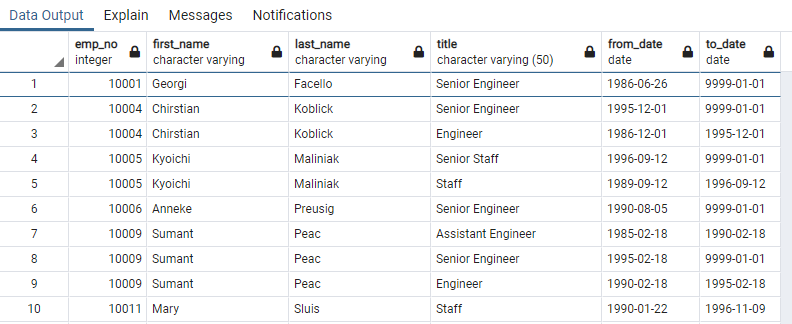
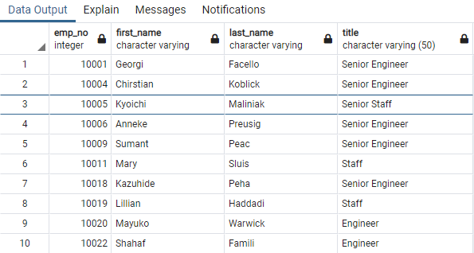
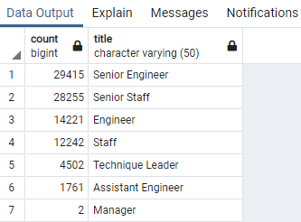
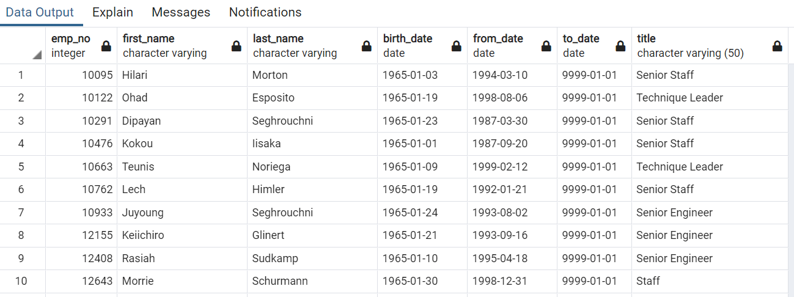
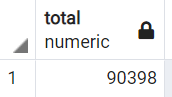
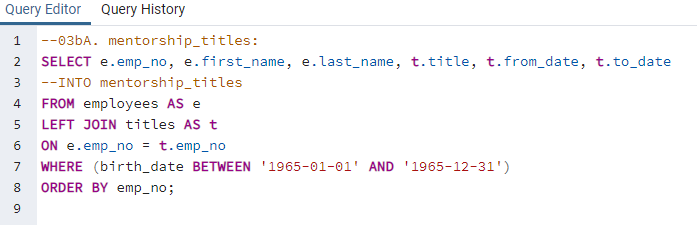
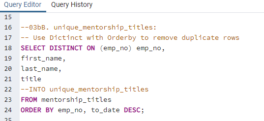
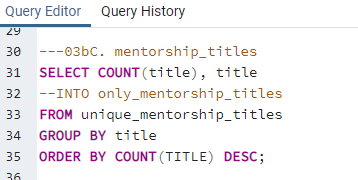
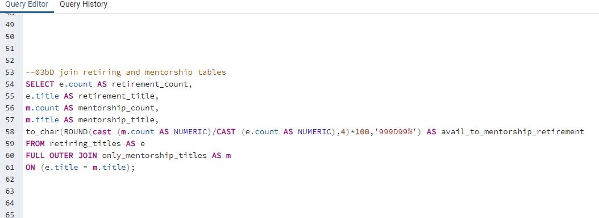
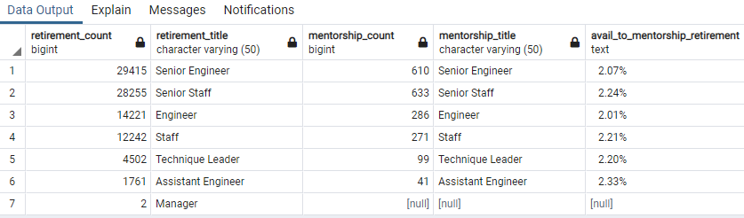

# Pewlett-Hackard Analysis
## Resources
pgAdmin 4 (Python: 3.8.3, Flask: 1.1.4), PostgreSQL 12.7

## Overview

In anticipation of the “silver tsunami” of baby boomer retirements, Pewlett Hackard is undertaking an analysis of upcoming retirements.  Relatedly, PH is running a separate analysis of the potential for a mentorship program, whereby soon to retire employees mentor the next generation of leaders in the company.  

## Results

[Fig1a: Retirement Titles](other_resources/1a_retirement_titles.png?raw=true "Figure 1a: Retirement Titles")

- Figure 1a is a query which isolates all employees born between 1952 and 1955 inclusive.  There are 133,776 results, but this includes duplicative employees who held different titles at different times.

[Fig1b: Retirement Titles](other_resources/1b_unique_titles.png?raw=true "Figure 1b: Unique Titles")

- The query depicted in Figure 1b removes those duplicative titles, and only displays the latest title, implying it will be the retirement title.  With 90,398 results returned, there are 1.5x more titles than employees, implying on average every other employee was promoted during the course of their respective careers at Pewlitt Hackard.

[Fig1c: Retirement Titles](other_resources/1c_retiring_titles.png?raw=true "Figure 1c: Retiring Titles")

- Figure 1c highlights the number of retiring employees by their title.  There are roughly 2x the number of ‘Senior’ Titles as the respective general titled brethren.  The workforce is top-heavy, and is in need of right-sizing.  That said, the employees who received promotions are likely higher quality employees, and may be the ones the company would prefer to keep.

[Fig2: Mentorship Eligibility](other_resources/2_mentorship_eligibility.png?raw=true "Figure 2: Mentorship Eligibility")

- Figure 2, with 1,549 rows returned, or less than 2% of the retiring employees, represent the employees eligible for mentorship under the proposed program.  There are plenty of mentors, but not very many available mentees.

## Summary

### Retirement roles requiring replacement

[Fig3aA: Total Retiring Employees](other_resources/3aA_total_retiring_employees_results.png?raw=true "Figure 3aA: Mentorship Eligibility")
Figure 3aA shows that total employees retiring number 90,398.

[Fig3aB: Total Retiring Employees](other_resources/3aB_total_retiring_employees.png?raw=true "Figure 3aB: Mentorship Eligibility")

The query depicted in Figure 3aB generated this value, and is simply the sum of the count of employees by title.

### Mentorship Opportunities

[Fig3bA: Total Retiring Employees](other_resources/3bA_mentorship_titles.png?raw=true "Figure 3bA: Mentorship Eligibility")

[Fig3bB: Unique Mentorship Titles](other_resources/3bB_unique_mentorship_titles.png?raw=true "Figure 3bB: Unique Mentorship Titles")

[Fig3bC: Only Mentorship Titles](other_resources/3bC_only_mentorship_titles.png?raw=true "Figure 3bC: Only Mentorship Titles")

[Fig3bDi: Retirement v Mentorship by Title](other_resources/3bDi_retirement_v_mentorship_by_title.png?raw=true "Figure 3bDi: Retirement v Mentorship by Title")

[Fig3bDii: Retirement v Mentorship by Title Results](other_resources/3bDii_retirement_v_mentorship_by_title_results.png?raw=true "Figure 3bDii: Retirement v Mentorship by Title: Results")

There are more than enough retirement ready employees prepared to mentor the next generation of leaders.  The problem will be that there are not enough of the next generation of leaders to replace the outgoing retirees.  Figures 3bA-Di build the query set, culminating in 3bDii, which shows that the mentorship eligible employees are generally only about 2% of retiring employees, a number that is consistent across titles, and indeed, across the company population as a whole.

